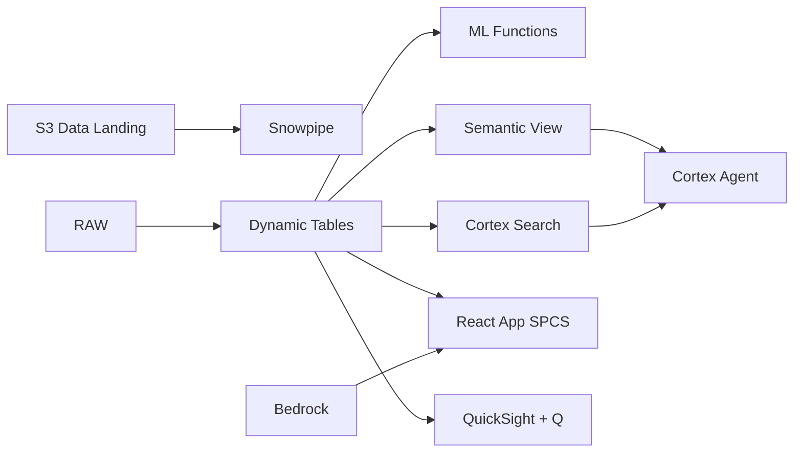

# Production Capacity Planning

Forecast semiconductor fab capacity across 12 facilities — ML.FORECAST projects wafer starts, Dynamic Tables optimize loading, and Cortex Agent answers planning queries in natural language.

## Architecture

Malaysia's 12 semiconductor fabs produce 470,000 wafers per month for Intel, Qualcomm, MediaTek, and Infineon. With 87% average utilization and 3 fabs approaching 95% ceiling, the VP Planning faces a RM 2.1 billion decision: which customers get capacity, which orders get deferred, and when to trigger RM 500M in CapEx expansion. Traditional capacity planning relies on weekly spreadsheet updates — by the time constraints are visible, customer commitments are already at risk.



## Snowflake Capabilities

| Capability | Implementation |
|-----------|---------------|
| Dynamic Tables | DEMAND_VS_CAPACITY / UTILIZATION_TIMESERIES / BOTTLENECK_ANALYSIS / REVENUE_AT_RISK |
| ML Functions | ML.FORECAST + ML.TOP_INSIGHTS |
| Cortex AI | COMPLETE, AI_CLASSIFY, SUMMARIZE |
| Cortex Search | 80 documents indexed |
| Cortex Agent | CAPACITY_PLANNING_AGENT |
| Semantic View | CAPACITY_PLANNING_ANALYTICS |
| React App (SPCS) | 5 tabs + DemoGuide |


## AWS Services

| Service | Role in Demo |
|---------|-------------|
| Amazon S3 | Store demand forecast files and planning documents from ERP systems |
| Amazon EventBridge | Trigger forecast refresh on new demand data arrival |
| Amazon Bedrock (Claude) | Generate capacity planning recommendations and CapEx narratives |
| Amazon QuickSight + Q | Capacity planning dashboard with natural language queries |


## Personas

| Persona | Role | Key Questions |
|---------|------|---------------|
| **Dr. Ooi Kok Beng** | VP Planning | "Which fabs are approaching capacity ceiling?" "What's the revenue at risk from capacity constraints?" |
| **Farah binti Hassan** | Capacity Planner | "Show me next month's demand vs capacity gap." "Which process steps are the bottleneck in FAB-003?" |


## Data

| Table | Rows | Description |
|-------|------|-------------|
| FAB_CAPACITY | 12 | Fabrication facility capacity (wafer starts/month, technology nodes, tool count) |
| DEMAND_FORECASTS | 1,000 | Customer demand forecasts by product, node, and month (rolling 12 months) |
| PRODUCTION_SCHEDULE | 8,000 | Wafer lot scheduling with start dates, completion targets, and priority |
| CAPACITY_CONSTRAINTS | 200 | Bottleneck constraints by process step, tool type, and fab |
| PLANNING_DOCS | 80 | Capacity planning guidelines, allocation policies, CapEx proposals |
| CUSTOMER_ORDERS | 1,500 | Confirmed customer orders with revenue and delivery commitments |


## Build Instructions

### Prerequisites
- Snowflake account with ACCOUNTADMIN access
- Cortex AI enabled (ML Functions, Search, Agent)
- Warehouse: SEMI_WH (Medium)
- AWS CLI with access (us-west-2)

### Deployment

```bash
snowsql -f snowflake/00_setup.sql
snowsql -f snowflake/01_marketplace_install.sql
snowsql -f snowflake/02_raw_tables.sql
snowsql -f snowflake/03_staging.sql
snowsql -f snowflake/04_dynamic_tables.sql
snowsql -f snowflake/05_search.sql
snowsql -f snowflake/06_ml_models.sql
snowsql -f snowflake/07_semantic_view.sql
snowsql -f snowflake/08_agent.sql
```

### React App (SPCS)
```bash
cd app && npm ci && npm run build
docker build -t aws-malaysia-semiconductor-capacity-app .
docker push bdiqc8sm-default.registry.snowflakecomputing.com/semiconductor_capacity/app/aws_malaysia_semiconductor_capacity/app:latest
```

### Demo Mode
Open the app URL with `?demo=true` for presenter view.

## Build Modes

### Snowflake Only
Run scripts 00-08 (skip AWS-specific integration). Uses:
- **Tasks + Streams (event-driven ingestion)** instead of Amazon S3
- **Tasks + Streams** instead of Amazon EventBridge
- **Cortex Complete** instead of Amazon Bedrock (Claude)
- **Snowflake Intelligence (Cortex Analyst)** instead of Amazon QuickSight + Q

### Full AWS + Snowflake
Run all scripts including AWS integration. Deploy QuickSight dashboard from `quicksight/`.

## Business Impact

Industry research and Snowflake customer outcomes:
- **Malaysia semiconductor exports reached RM 450B (US$98B) in 2023, representing 18.4% of GDP** — [MIDA](https://www.mida.gov.my/setting-up-in-malaysia/why-malaysia/)
- **Semiconductor capacity constraints cost the automotive industry alone $210B in 2021-2022** — [McKinsey Semiconductors](https://www.mckinsey.com/industries/semiconductors/our-insights)
- **AI-driven capacity planning improves forecast accuracy by 20-30% vs traditional methods** — [Gartner Supply Chain](https://www.gartner.com/en/supply-chain)
- **Siemens** (Snowflake customer): processes 2+ petabytes of manufacturing data on Snowflake for real-time yield and quality analytics across global fabs -- [snowflake.com/customers/siemens](https://www.snowflake.com/en/customers/all-customers/case-study/siemens-1/)


## Key Demo Numbers

- **12 fabs** 470K wafers/month total capacity across Penang/Kulim
- **87% utilization** average across all fabs (target: 90%)
- **3 fabs** approaching 95% capacity ceiling
- **RM 2.1B** quarterly revenue at risk from capacity constraints
- **8,200 wafers** demand-capacity gap at FAB-003 next quarter
- **80 planning docs** indexed and searchable via Cortex Search


## License

Apache 2.0 — See [LICENSE](LICENSE) for details.

This is a personal demo project and is not an official Snowflake offering. It comes with no support or warranty.